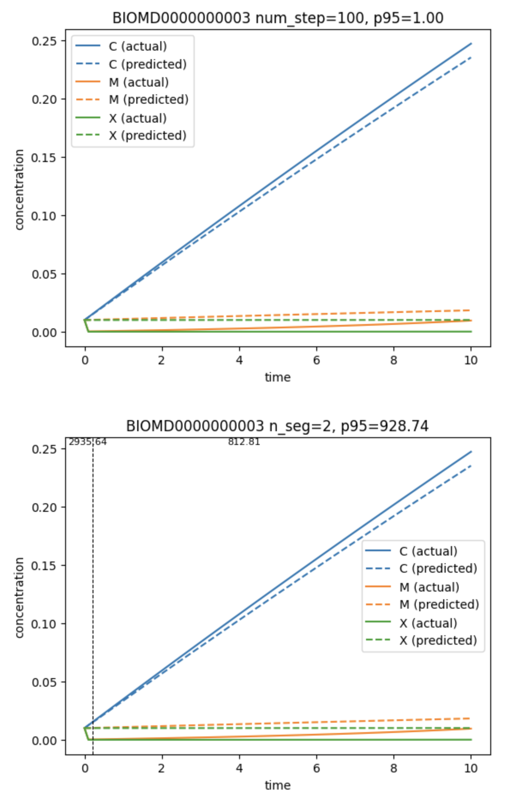

# Segment Scores

I don't understand the results for segment scores in cell 5 of @score_analysis.ipynb.

Consider In the top plot, ``LinearPredictor`` is used to construct predictions (dashed lines) vs. the true values (solid lines) for all species across the entire time course. The 95th percentile of relative absolute error (RAE), denoted p95, is 1.0. In the bottom plot, The time course is split into two segments, as indicated by the vertical dashed line, and prediction is done using ``MultipleLinearPredictor``. Here the 95th percentile of RAE is 928.74. However, the top and bottom plots don't look to different. What is there such a large difference in p95 for the two plots?